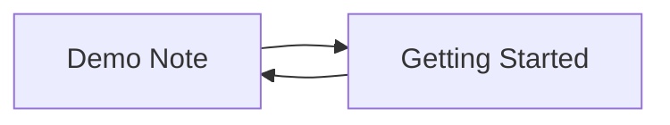

# Demo Note

This is a demo note to showcase wikilinks and interactive markdown features!

## Wikilinks

Wikilinks let you connect your notes together, creating a personal knowledge base.

- [[Getting Started]] - Link back to the main documentation
- [[Getting Started#Graph View]] - Link to a specific heading
- [[Getting Started|Main Guide]] - Custom display text with `|`

### Creating Wikilinks

1. Press `e` to enter edit mode
2. Type `[[` to see autocomplete suggestions
3. Add `#` to link to specific headings
4. Add `|` to customize the display text
5. Press `Ctrl+s` or `:w` to save

### Navigation

- Press `Space` or click on any wikilink to navigate
- Use `]` to jump to next link, `[` for previous
- Links to non-existent notes will prompt to create them

## Interactive Elements

### Math

Inline expressions such as $E = mc^2$ and \(\displaystyle \sum_{i=1}^n i\) render directly inside prose. Use `$$` or `\[` and `\]` delimiters for a display equation:

$$
\frac{-b \pm \sqrt{b^2 - 4ac}}{2a}
$$

Set equation sizes in the `[general]` section of `~/.config/ekphos/config.toml`:

```toml
[general]
latex_height = 8
inline_latex_height = 2
```

### Tasks with Links

- [ ] #task Check out the [[Getting Started]] guide
- [ ] #task Try pressing `Space` on this checkbox
- [x] #task Complete the tutorial

### Collapsible Content

<details>
<summary>Wikilink Ideas</summary>

Here are some ways to use wikilinks:
- Create a **daily notes** system with links between days
- Build a **zettelkasten** for research and learning
- Organize **project notes** with interconnected topics
- Make a **personal wiki** for anything you want to remember
</details>

> [!tip]- Callouts
> Obsidian callouts work too. Press `Space` or `za` on the title to expand or collapse this one.

## Graph View



Mermaid diagrams like the one above render inline. Press `Enter` on one to zoom and pan.

Press `Ctrl+g` to see this note's Local graph. Use `Space` to focus another node, `]` to reveal another connection depth, or `v` to see the complete vault.

Happy linking!
