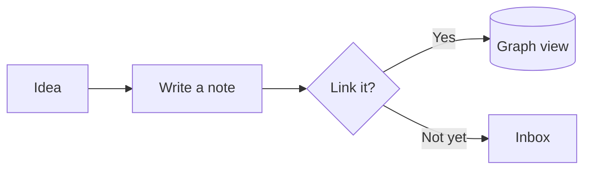

# Getting Started

A lightweight, fast, terminal-based markdown research tool built with Rust.

## Frontmatter

This note has YAML frontmatter! Look at the tag badges above. Press `Ctrl+m` to toggle viewing the raw frontmatter.

## Layout

Ekphos has three panels:

- **Sidebar** (left): Collapsible folder tree with notes
- **Content** (center): Note content with markdown rendering
- **Outline** (right): Auto-generated headings for quick navigation

Use `Tab` or `Shift+Tab` to switch between panels.

**Collapsible Panels:**

- `Ctrl+b` to collapse/expand the sidebar
- `Ctrl+o` to collapse/expand the outline

## Quick Start

These are the default app shortcuts. You can remap them in the `[keybindings]`
section of `~/.config/ekphos/config.toml`.

- `j/k`: Navigate up/down
- `e`: Enter edit mode
- `n`: Create a note, Canvas, or Base
- `t`: Open today's journal
- `/`: Search notes
- `?`: Show help dialog
- `Ctrl+g`: Open the active note's Local graph
- `Ctrl+y`: Open the task view (all tasks across the vault)
- `Ctrl+z`: Toggle zen mode
- `Ctrl+m`: Toggle frontmatter
- `F6`: Switch between Standard and Vim editing

Inside a Canvas, right-click to add or manage cards, or press `a` to open the
add menu. Double-click empty space to create a text card. Drag cards to move
them, drag empty space to pan, and use the visible handles to resize or connect.
Press `F3` to expand the full shortcut legend; Canvas undo/redo use `u` and
`Ctrl+r`, leaving global `Ctrl+z` zen mode and `Ctrl+y` Task View unchanged.

New installations use Standard editing: type normally, select with `Shift` plus the arrow keys, press `Ctrl+s` to save, and press `Esc` to return to preview. `Ctrl+a/c/x/v/z/y/f` provide familiar select, clipboard, undo, redo, and find actions. Press `F1` while editing for the full reference.

While editing, press `Ctrl+l` to turn the current plain or bulleted line into a task. Press `Tab` on an H1–H3 heading to fold its section; `Tab` keeps its normal indentation behavior on other lines. Vim normal mode also supports `za`, `zM`, and `zR`. Remap these editor commands with `insert_task` and `toggle_editor_fold` in `[keybindings]`.

Choose an editing mode in `~/.config/ekphos/config.toml`:

```toml
[editor]
mode = "standard" # or "vim"
```

Equations keep one consistent size, like in Obsidian. `latex_height` is the
number of rows a display fraction such as the quadratic formula takes, and
`inline_latex_height` is the number of rows a fraction inside prose takes.
Taller equations, such as matrices, aligned systems, or `\displaystyle` sums,
grow in proportion. The inline default is two terminal rows; use `1` for a more
compact layout.

```toml
[general]
latex_height = 8
inline_latex_height = 2
```

Press `F6` to switch immediately and save the choice. Existing configurations without a `mode` setting continue to use Vim. Terminal emulators may handle clipboard shortcuts themselves; terminal paste and the editor context menu remain available.

## Frontmatter Templates

Ekphos can add saved frontmatter to new notes according to their folder. Put YAML
fragments in `~/.config/ekphos/templates/`, without `---` delimiters. For example,
`project.yaml` could contain:

```yaml
title: "{{title}}"
created: "{{date}}"
folder: "{{folder}}"
tags: [project]
```

Map vault-relative folders to template files in `config.toml`:

```toml
[frontmatter_templates]
"." = "default.yaml"
"Projects" = "project.yaml"
"Projects/Clients" = "client.yaml"
```

The closest mapped folder wins, so `Projects` also covers its subfolders. `.` is
the vault root. Placeholders work in quoted YAML string values and expand to the
note title, local date, and destination folder. Template file edits apply to the
next note immediately; reload Ekphos config after changing the mappings. Journal
notes keep their dedicated dated format.

Press `?` for the app keybind reference, or visit [docs.ekphos.xyz](https://docs.ekphos.xyz) for comprehensive editing, theme, and configuration documentation.

## Interactive Demo

Try these interactive elements! Press `Space` or click to interact:

### Checklists and Tasks

- [ ] Try pressing Space on this checklist item
- [ ] Or click the checkbox to toggle it
- [x] This checklist item is already complete

Add `#task` to a checkbox when you want Ekphos to manage it as a task. Managed
tasks can carry due dates and priorities, and `Ctrl+y` aggregates them into one
filterable view. Plain checklists stay out of Task View.

- [ ] #task Pay rent +home 📅 2026-06-01 ⏫
- [ ] #task Draft weekly review 🔼
- [ ] #task Someday: learn Nix 🔽

Tokens: `📅 2026-06-01` due date, `🛫 2026-06-01` start date, `⏫`/`🔼`/`🔽` priority.
Completing a managed task (here or in Task View) stamps a `✅` completion date
automatically. It's all plain Markdown, so Obsidian's Tasks plugin reads the same lines.

### Wikilinks

Navigate between notes using wikilinks:

- [[02-Demo Note]] - Press `Space` or click to visit
- Use `]` and `[` to jump between links on a line
- In edit mode, type `[[` for autocomplete suggestions
- [[Non-existent Note]] - Opens a dialog to create it!

### Collapsible Sections

<details>
<summary>Click or press Space to expand this section</summary>

This content is hidden by default! Great for:
- FAQs and documentation
- Optional information
- Keeping notes organized
</details>

<details>
<summary>Another collapsible section</summary>

You can have multiple collapsible sections in one note.
Each maintains its own open/closed state.
</details>

## Graph View

Press `Ctrl+g` to open a fast Local graph centered on the active note.

- `[` / `]` changes connection depth, and `d` filters incoming/outgoing links
- Press `Enter` to open the focused node
- Press `Space` to explore the selected note without leaving the graph
- Press `v` for the complete vault graph and `/` to filter by title, path, or `#tag`
- Click nodes to select, double-click to open, drag to pan, and scroll to zoom

## Markdown Features

Ekphos renders a rich subset of Markdown right inside your terminal.

### Headings

Use `#` through `######` for six levels of headings. H1–H3 are foldable — press `Tab` or `Space` on a heading to collapse the section beneath it — and every heading shows up in the Outline panel for quick navigation.

### Text Formatting

- **Bold text** with `**double asterisks**` (or `__underscores__`)
- *Italic text* with `*single asterisks*` (or `_underscores_`)
- `Inline code` with backticks
- ~~Strikethrough~~ with `~~double tildes~~`

### Lists

Unordered, ordered, and nested lists are all supported:

- First bullet (`-` or `*`)
- Second bullet
    - Nested item with indentation
    - Another nested item
- Third bullet

1. Ordered lists use numbers
2. They render in sequence
3. Great for step-by-step instructions

### Tables

Pipe tables support per-column alignment (set with `:` in the separator row) and `<br>` for line breaks inside a cell:

| Alignment | Marker  | Example                   |
| :-------- | :-----: | ------------------------: |
| Left      | `:---`  | text hugs the left        |
| Center    | `:---:` | centered                  |
| Right     | `---:`  | numbers line up           |
| Wrapping  | `<br>`  | first line<br>second line |

### Code Blocks

Fenced code blocks get syntax highlighting based on the language tag:

```rust
fn main() {
    println!("Hello, Ekphos!");
}
```

### Mermaid Diagrams

A fenced block tagged `mermaid` renders as a diagram in the note's theme colors:



Press `Enter`, `Space`, or click a diagram to explore it full screen:

- `+`/`-` or the scroll wheel zoom, and `h j k l`, the arrow keys, or dragging pan
- `f` fits the diagram to the screen and `1` shows it at actual size
- `t` switches between the note theme and Mermaid's light and dark looks
- `[`/`]` move between the diagrams in a note
- `e` jumps to the source, `y` copies it, and `?` lists every control

Flowcharts, sequence, class, state, ER, Gantt, pie, mindmap, timeline, and most other Mermaid diagram types are supported, along with `%%{init: ...}%%` theme settings. Diagrams need a terminal with image support. `diagram_height` limits how many rows a diagram takes inside a note:

```toml
[general]
diagram_height = 20
```

### Blockquotes

> Blockquotes are rendered with a colored border.
> Great for highlighting important information.

### Callouts

Obsidian callouts turn a blockquote into a titled, colored block. Start its first line with `[!type]`:

> [!note]
> A callout without a title uses its type as the title.

> [!tip] Callouts can have custom titles
> The body supports **formatting**, [[02-Demo Note|links]], `code`, and lists:
> - 13 types, from `note` and `tip` to `warning` and `bug`
> - Obsidian aliases such as `tldr`, `faq`, and `error`

> [!warning]- Add `-` to collapse a callout
> Press `Space`, `za`, or click the title to toggle it. Use `+` instead to make a callout foldable but open by default.

> [!question]+ Can callouts be nested?
> > [!success] Yes
> > Add another `>` for each level.

### Horizontal Rules

Use `---`, `***`, or `___` on their own line to draw a divider:

---

### Links

- [Inline links](https://docs.ekphos.xyz) with `[text](url)`
- Bare URLs like https://ekphos.xyz are auto-detected
- Press `Enter`, `o`, or click to open a link in your browser

### Images

Embed images with ``. Press `Enter`, `o`, or click to open in system viewer.


Inline preview works in terminals with image support (iTerm2, Kitty, WezTerm, Ghostty, Sixel).

---

Read the docs at [docs.ekphos.xyz](https://docs.ekphos.xyz) for full documentation, editing modes, themes, and configuration.

Press `q` to quit. Happy note-taking!
